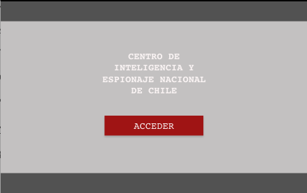
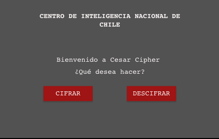
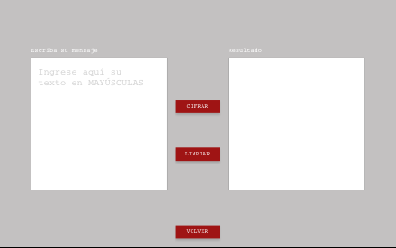

# Cifrado César

Basado en el contexto político social que ha sufrido Chile el último mes, donde la ciudadanía ha expresado su molestia contra el sistema y la clase política de diferentes maneras y estrategias. 

Se ha creado una plataforma de cifrado para uso institucional del gobierno, con el objetivo de encriptar los mensajes privados o cualquier tipo de texto de carácter confidencial, entregando a los usuarios una herramienta para poder cifrar o descifrar el contenido.

El programa esta destinado a funcionarios y colaboradores del gobierno con acceso privado y exclusivo a la plataforma. El producto digital responde a una necesidad de seguridad institucional para resguardar cualquier tipo de información confidencial gubernamental, evitando en parte a la ciberdelincuencia de robo de datos a la cual se ve enfrentada el gobierno.

